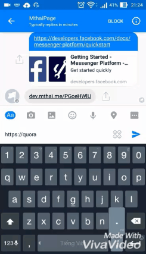

Developed using [ExpressJs](http://expressjs.com/). For more information on Facebook Messenger Platform, read the [QuickStart Guide](https://developers.facebook.com/docs/messenger-platform/quickstart).

# How to run
Make sure to have the following environment variables:
- PAGE_TOKEN (Facebook page token)
- MYSQL_USERNAME
- MYSQL_PASSWORD

Run `npm start`

# How it works

# Contribution
Any contribution is super welcomed :)
